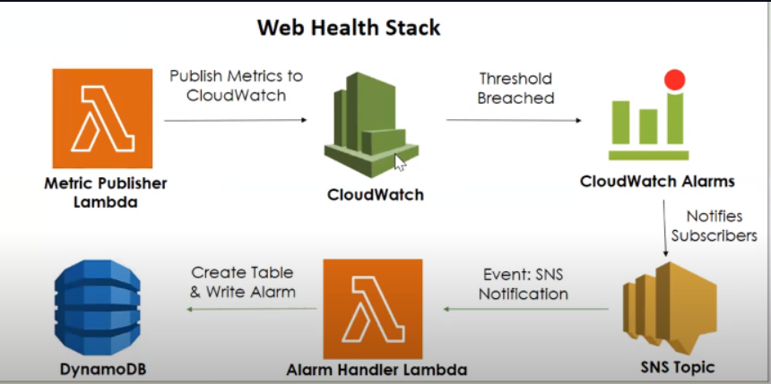
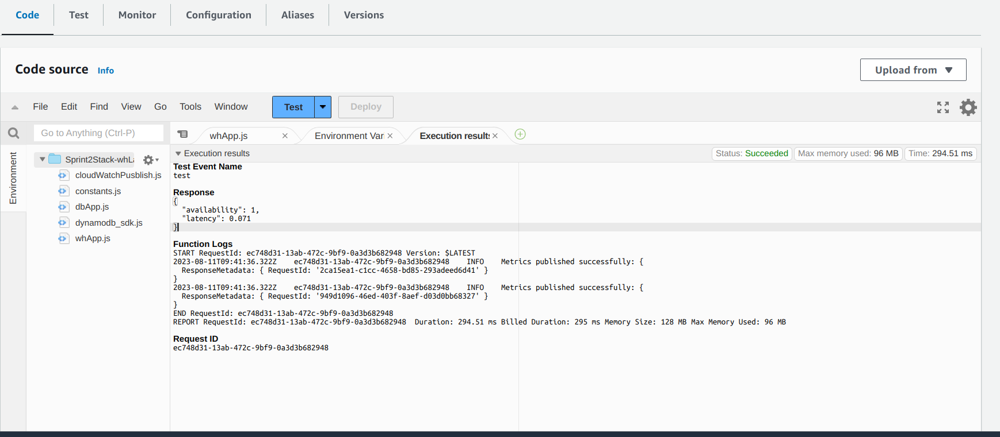
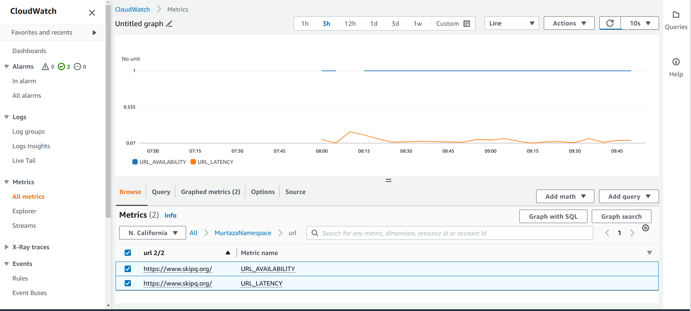
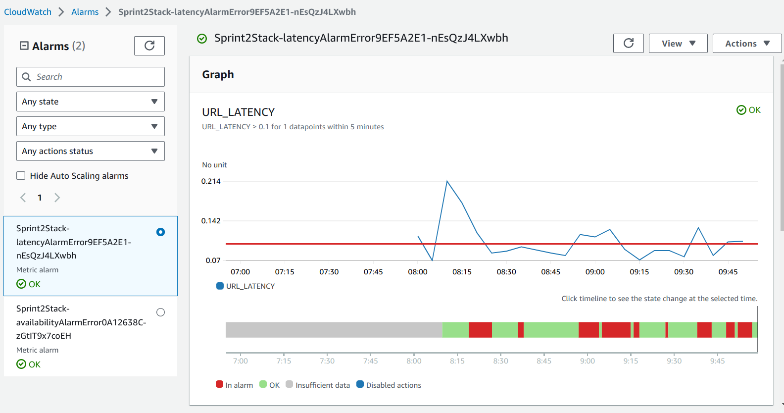
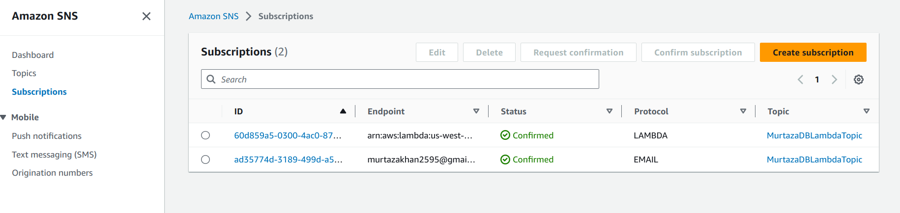
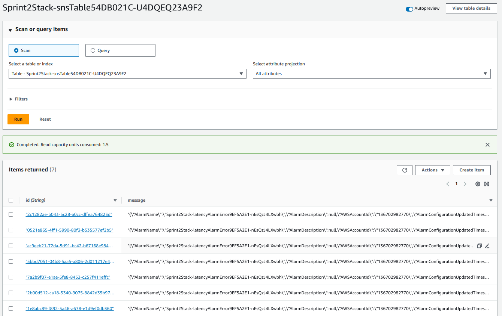

# Welcome to your CDK Python project!

## **Topics**:

- ### [Prerequisite](##-**Prerequisite:**)
- ### [Use commands](##-Useful-commands).
- ### [Design of Web Health Project](##-Project-Design:).
- ### [Creating Lambda](##-***Creating-Lambda:***).
- ### [Convert lambda into cronjob](##-***Converting-my-Lambda-into-cronjob:***).
- ### [Publish Lambda to cloudwatch metrics](##-***Publish-Metrics-To-Cloudwatch:***).
- ### [Set Trigger Alarm on Metrics](##-***Add-Alarm-to-the-cloud-watch:***).
- ### [Set SNS On Alarm](##-***Set-SNS-On-Alarm:***).
- ### [Create DynamoDB Table](##-***Creating-DynamoDB-Table:***).

## **Prerequisite:**

The `cdk.json` file tells the CDK Toolkit how I execute my app.

The initialization process creates a virtualenv within this project, stored under the `.venv`
directory. To create the virtualenv it assumes that there is a `python3`
(or `python` for Windows) executable in my path with access to the `venv`
package. If for any reason the automatic creation of the virtualenv fails,
you can create the virtualenv manually.

To manually create a virtualenv on MacOS and Linux:

```
$ python3 -m venv .venv
```

After the init process completes and the virtualenv is created, you can use the following
step to activate your virtualenv.

```
$ source .venv/bin/activate
```

If you are a Windows platform, you would activate the virtualenv like this:

```
% .venv\Scripts\activate.bat
```

Once the virtualenv is activated, you can check the installation of NVM and NPM installation:

#### **Step:1**

```
$ curl -o- https://raw.githubusercontent.com/nvm-sh/nvm/v0.38.0/install.sh | bash
```

#### **Step:2**

After running the above commands, it's time to add a variable to your bash command. Normally, it was located from these file paths:

```
$ nano ~/.bash_profile
```

Then paste the code below, then hit crtl + o + enter then ctrl + x to close the file.

```
export NVM_DIR="$([ -z "${XDG_CONFIG_HOME-}" ] && printf %s "${HOME}/.nvm" || printf %s "${XDG_CONFIG_HOME}/nvm")"
[ -s "$NVM_DIR/nvm.sh" ] && \. "$NVM_DIR/nvm.sh" # This loads nvm
```

Then source ~/.bash_profile to set up environment for NVM:

```
$ source ~/.bash_profile
```

#### **Step:3**

To check the available lists of available node version that you can use. Type this command.

```
$ nvm ls-remote
```

NVM can install any of these versions available in the list. For example, to install version v16.3.0, type:

```
nvm install v16.3.0 && nvm use v16.3.0 && nvm alias default v16.3.0
```

Then install aws cdk module:

```
$ npm install -g aws-cdk
```

After that install all the dependencies:

```
$ npm install
```

At this point you can now synthesize the CloudFormation template for this code.

```
$ cdk synth
```

To add additional dependencies, for example other CDK libraries, just add
them to your `pakage.json` file and rerun the `npm install`
command.

## Useful commands

- `cdk ls` list all stacks in the app
- `cdk synth` emits the synthesized CloudFormation template
- `cdk deploy` deploy this stack to your default AWS account/region
- `cdk diff` compare deployed stack with current state
- `cdk docs` open CDK documentation

## **Website-health Application**

After the dependencies I have my **bin** and **lib/user_stack.py** file in my folder.

## **Project Design:**

The structural design of my project is given below:


## **_Creating Lambda:_**

To create a Web Health application, I have created a Lambda file in my stack file using [Lambda Function API](https://docs.aws.amazon.com/cdk/api/v2/python/aws_cdk.aws_lambda/Function.html).

After Updated my stack file, I have created a "Resources" Folder in I stored every files which I needed during the designing of this application.  
In the "Resource"folder I have created "WHApp.js" file and link this file with my lambda file as a handler.

I have used "URLs_Monitor" as input data, but where this data is? This data are in the another file called "constants" because I will recall the same data again and again in future. So, that's why I called "import constants" in my "WHApp.js" code.



## **_Converting my Lambda into cronjob:_**

To convert get update time to time I have to convert my Lambda into a cronjob, I just add [shedule](https://docs.aws.amazon.com/cdk/api/v2/python/aws_cdk.aws_events/Schedule.html) form [aws event API](https://docs.aws.amazon.com/cdk/api/v2/python/aws_cdk.aws_events.html) and also I set [target](https://docs.aws.amazon.com/cdk/api/v2/python/aws_cdk.aws_events_targets/LambdaFunction.html) to my lambda function. Also I add [Removal Policy](https://docs.aws.amazon.com/cdk/api/v2/python/aws_cdk.aws_lambda/Function.html#aws_cdk.aws_lambda.Function.apply_removal_policy) to my stack file as well:

## **_Publish Metrics To Cloudwatch:_**

After the conjob my Lumbda update after time to time (I set 60 minutes), now from where can I see the update result? The updated result should be appear in some kind of graph so I can see the previous one and updated one. for this I Publish my Lambda to "cloudwatch" (AWS service). I used AWS SDK for javascript to publish my cloud metrics. Since it is a SDK module, so I updated my code in "WHApp.js" and also created another cloudwatch file to store all the cloud data as a library and call it, in the "WHApp.js" file.

Then I called this class in my WHApp.js and updated my _constants.js_ with _namespace_, and _metric_name_.

I


## **_Add Alarm to the cloud watch:_**

Now I can see the graph of the metrices that is recorded by AWS Event. But I want to set some _threshold_ so, whenever it cross the threshold in the [Metric](https://docs.aws.amazon.com/cdk/api/v2/python/aws_cdk.aws_cloudwatch/Metric.html) value the [Alram](https://docs.aws.amazon.com/cdk/api/v2/python/aws_cdk.aws_cloudwatch/Alarm.html) will raise.

Lambda does not allow to use another services of AWS. Due this reason I add [LambdaRole](https://docs.aws.amazon.com/lambda/latest/dg/lambda-intro-execution-role.html) to give the access to Lambda to the cloudwatch. The API I used for this purpose is [iam](<(https://docs.aws.amazon.com/cdk/api/v2/python/aws_cdk.aws_iam/IRole.html#aws_cdk.aws_iam.IRole)>). I created new function for this library.



## **_Set SNS On Alarm:_**

The SNS is a [Simple Notification Service](https://aws.amazon.com/sns/) offer by AWS. I used this AWS service, so whenever the Alarm trigger, it will inform me on Email, phone and etc. I used [SNS Topic](https://docs.aws.amazon.com/cdk/api/v2/python/aws_cdk.aws_sns/Topic.html) template to create my alram topic and also set [SNS subscription](https://docs.aws.amazon.com/cdk/api/v2/python/aws_cdk.aws_sns_subscriptions/EmailSubscription.html) template to attach my Email. These all updatation I have in my _stack file_ (after the event rule). Also I used [SNS Action](https://docs.aws.amazon.com/cdk/api/v2/python/aws_cdk.aws_cloudwatch_actions/SnsAction.html) template to define which alram will trigger, in my case they are \*Availability_Alarm" and "Latency_Alarm"


## **_Creating DynamoDB Table:_**

I created a table to SNS log. For that, First I have created another lambda function called "DB_Lambda" has the same parameters as previous lambda only name and file location changed

Ater that I have created a Table in the same function

Template for [.add_subscription](#https://docs.aws.amazon.com/cdk/api/v2/python/aws_cdk.aws_sns_subscriptions/LambdaSubscription.html) and [.add_environment](https://docs.aws.amazon.com/cdk/api/v2/python/aws_cdk.aws_lambda/Function.html#aws_cdk.aws_lambda.Function.add_environment).

**! Don't Forget** to add the permission in Lambda_role for Dynamo DB

Now the last thing is to define DynamoDB application for which I have created file in the _Resources Folder_. I used SDK library, javascript resources in this file and for the environment variable I used process.env.TABLE_NAME library to make a table name as global variable, and populate the table:


